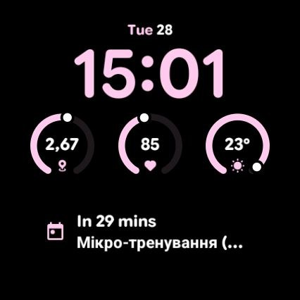

# Utility — Watch Face Format rebuild

A rebuild of the Pixel Watch **Utility** watch face in [Watch Face Format][wff],
for Wear OS 5 and newer. Date row, clock, three round complication slots, and a
`LONG_TEXT` row that defaults to the next calendar event. Colour (35 colourways
from the original), **Bold Time** and all four slots are editable on the watch.



The bottom row is the `LONG_TEXT` slot, here showing the next calendar event.

If you moved to a Pixel Watch 4 and found Utility missing, this is why: Google
dropped the face in version 4.x of its Pixel Watch faces package, along with every
`LONG_TEXT` complication slot in that package, so none of the faces it ships can
show a next calendar event. Utility Bold is the closest one left and it has no
event row. Third-party faces still can — [Digital
Informer][di] does, in the same Watch Face Format — just not in Utility's layout,
which is the point of this rebuild. Sideloading the 3.x APK does not work either:
WearServices checks a legacy watch face's signing key against an allowlist, and a
resigned copy can never pass. That check only applies to faces identified by a
service class name, and Watch Face Format faces have none, hence this rebuild.

The layout is generated by `gen_wff.py` from measurements taken off the original
rather than guessed. [NOTES.md](NOTES.md) collects what the format turned out to
require along the way, and the scripts used to verify the result.

## Install

[Releases](../../releases) carry a build that uses the device font, so it
contains none of Google's assets:

```bash
adb install -r UtilityWFF-4.0-device-font.apk
```

Then long-press the watch face, pick **Utility**, and tap the pencil to
configure. Signed with a debug key, so sideloading only.

## Build

Needs the Android SDK build-tools and a debug keystore. No Gradle.

```bash
python3 gen_wff.py     # generates wff/res/raw/watchface.xml, which is not committed
./build_wff.sh         # aapt2 -> zipalign -> apksigner
adb install -r build-wff/UtilityWFF.apk
```

`build_wff.sh` picks the newest build-tools and platform in your SDK; override
with `SDK`, `BUILD_TOOLS`, `PLATFORM`, `KS`. Pass `--no-google-assets` to
`gen_wff.py` to reproduce the released variant exactly.

The original's clock fonts and preview art are Google's proprietary assets and
are not in this repository; without them the build falls back to the device font,
which on a Pixel Watch is Google Sans anyway. To use the originals, extract them
from your own copy of a 3.x `com.google.android.wearable.watchface.rwf` APK —
4.x no longer carries the face:

```bash
python3 scripts/extract_assets.py path/to/rwf-3.x.apk
python3 gen_wff.py && ./build_wff.sh
```

That reproduces the same APK byte for byte as the build this face was verified
from, on a Pixel Watch 4 and the Wear OS 7 emulator.

---

MIT ([LICENSE](LICENSE)). Layout, colourway names and proportions are derived
from Google's Utility watch face; not affiliated with or endorsed by Google.

[wff]: https://developer.android.com/training/wearables/wff
[di]: https://play.google.com/store/apps/details?id=com.amoledwatchfaces.digitalinformer
