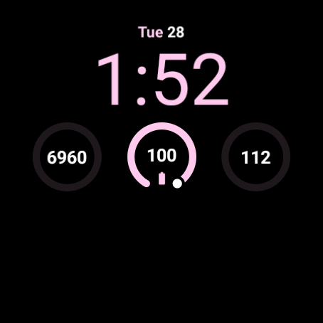

# Utility — Watch Face Format rebuild

A rebuild of the Pixel Watch **Utility** watch face in [Watch Face Format][wff],
for Wear OS 5 and newer.

The face is generated from a Python script rather than hand-written XML, so the
geometry is expressed as measurements rather than magic numbers.



*Rendered with the device font — see [Fonts and preview image](#fonts-and-preview-image).*

## Why this exists

Utility (internally `numerique`) shipped in version 3.x of Google's
`com.google.android.wearable.watchface.rwf` package. Version 4.x, which is what
a Pixel Watch 4 carries, **dropped it** — along with every other
`LONG_TEXT` complication slot in that package, so nothing there can host a
"next calendar event" row any more.

Sideloading the old APK does not work either. Wear OS refuses it:

```
W/WearServices: [WFInfoResolver] Blocked watch face WatchFaceId[…]
```

`WatchFacesBlockingManagerImpl.isBlockedWatchFace()` checks the SHA-256 of the
APK's signing public key against an allowlist, and only applies that check to
**legacy** watch faces — the ones identified by a service class name:

```java
if (watchFaceId.getClassName() != null) {         // legacy watch face
    if (checkPermission("com.google.wear.permission.BYPASS_COMPLICATIONS_RESTRICTION", pkg) == 0)
        return false;
    if (!allowlist.contains(sha256(signingPublicKey)))
        return true;                              // blocked
}
return false;
```

A resigned copy can never pass. Watch Face Format faces have no class name, so
the check is skipped entirely — hence this rebuild.

## Download

[Releases](../../releases) carry a build that uses the device font, so it
contains none of Google's assets and installs as-is:

```bash
adb install -r UtilityWFF-4.0-device-font.apk
```

To get the original's clock fonts, build from source after extracting them —
see below.

## Build

Requires the Android SDK build-tools and a debug keystore. No Gradle.

```bash
python3 gen_wff.py     # generates wff/res/raw/watchface.xml
./build_wff.sh         # aapt2 -> zipalign -> apksigner
adb install -r build-wff/UtilityWFF.apk
```

`wff/res/raw/watchface.xml` is generated and deliberately not committed — edit
`gen_wff.py`, not the XML.

The build script picks the newest build-tools and platform in your SDK. Override
with `SDK`, `BUILD_TOOLS`, `PLATFORM`, `KS`, `KS_ALIAS`, `KS_PASS`.

Activating it without touching the watch:

```bash
adb shell am broadcast -a com.google.android.wearable.app.DEBUG_SURFACE \
  --es operation set-watchface --es watchFaceId com.ivan.watchface.utility
```

Note the extra is `watchFaceId` with the **package name only**. A WFF face has
no component, so the `--ecn component` form used for legacy faces fails with
`FavoriteOperationException: Watch face package is not installed`.

## Fonts and preview image

The original's clock fonts and preview art are Google's proprietary assets and
are **not** in this repository. Without them the face builds and runs using the
device font — on a Pixel Watch that is Google Sans anyway.

To use the originals, extract them from your own copy of a 3.x `rwf` APK:

```bash
python3 scripts/extract_assets.py path/to/rwf-3.x.apk
python3 gen_wff.py && ./build_wff.sh
```

## What it looks like

Modular II layout: a date row, the clock, three round complication slots, and a
`LONG_TEXT` row at the bottom that defaults to the next calendar event.

Configurable in the watch face editor:

- **Colour** — 35 colourways, names and values taken from the original
- **Bold Time** — the original's `BOLDTIME` setting
- all four complication slots

Steps and heart rate default to Fitbit's `GOAL_PROGRESS` / `RANGED_VALUE` data
sources, which is what gives those rings an arc; the system `STEP_COUNT` and
`HEART_RATE` sources only offer `SHORT_TEXT` and would render a plain ring.

## Things worth knowing about Watch Face Format

Collected while building this; each one cost a debugging round trip.

| | |
|---|---|
| `align="LEFT"` is not valid | Use `START` / `CENTER` / `END`. An invalid value silently falls back to `CENTER`. |
| `PartDraw` clips its children | A ring stroked along an oval that fills the `PartDraw` loses the outer half of its stroke. Give the `PartDraw` the full slot and inset the oval instead. |
| `tintColor` needs format version ≥ 3 for expressions | With `version=2` a literal colour tints but `[CONFIGURATION.x.0]` is silently ignored. |
| `tintColor` composites multiplicatively | It cannot recolour a saturated provider icon. Paint a solid fill and use the icon as a `renderMode="MASK"` sibling instead. |
| `blendMode` is element-vs-canvas | `SRC_IN` there clips the whole complication away; it is not a tint mode. |
| `TimeText` formats time only | Dates come from `[DAY_OF_WEEK_S]`, `[DAY]`, `[MONTH_S]` inside a `PartText` template. |
| One `Text` may hold several `Font` runs | The way to mix colours in one centred line. Two side-by-side `PartText` boxes drift off centre by half the difference of their widths. |
| `BooleanConfiguration` can wrap scene content | `BooleanOption` children may contain a `DigitalClock`; `Condition` accepts only `Part*` elements. |
| Partially-instanced variable fonts deform | `GoogleSansFlexTimeOnly_wght_300…ttf` still carries `fvar`/`gvar`. WFF asks for `NORMAL` (400) by default and interpolating away from the pinned instance visibly wrecks the outlines. Pin `weight` to the file's own value. |
| Favourites remember slot bindings | Changing a `DefaultProviderPolicy` has no effect until the favourite is recreated; a full uninstall is the reliable reset. |
| `screencap` is stale while dozing | It returns the last composited frame. Force a redraw first, or read the always-on composition with `gen_wff.py --aod-preview`. |

## Always-on

Every part carries a `Variant mode="AMBIENT" target="alpha"`, so always-on is the
same composition at a lower alpha — nothing is removed and the clock keeps its
configured weight. On-pixel ratio measured on device: 6.4 % interactive, 4.7 %
ambient, against a 15 % ceiling.

Content is dimmed only modestly on purpose. The panel already dims itself and
does so *adaptively* via the ambient light sensor; a fixed low alpha would make
always-on unreadable in daylight. `AMBIENT_ALPHA` in `gen_wff.py` is the knob.

## Tools

`tools/` holds the measurement scripts used to check the result against the
original instead of eyeballing it — none of them need image libraries.

| | |
|---|---|
| `opr.py` | on-pixel ratio of a frame, against the 15 % always-on ceiling |
| `balance.py` | vertical centroid of the lit pixels and its distribution |
| `stroke.py` | stroke thickness normalised by digit height |
| `crop.py` | crop and upscale a region for inspection |
| `pair.py` | two frames side by side with centre and centroid guides |

`scripts/watch.sh`, `ab.sh` and `shot.sh` drive a watch over adb; set `WATCH` to
its serial.

## Licence

Code and the watch face definition: [MIT](LICENSE).

The layout, colourway names and proportions are derived from Google's Utility
watch face, and the optional fonts and preview art are Google's. This is a
personal-use rebuild, not affiliated with or endorsed by Google.

[wff]: https://developer.android.com/training/wearables/wff
